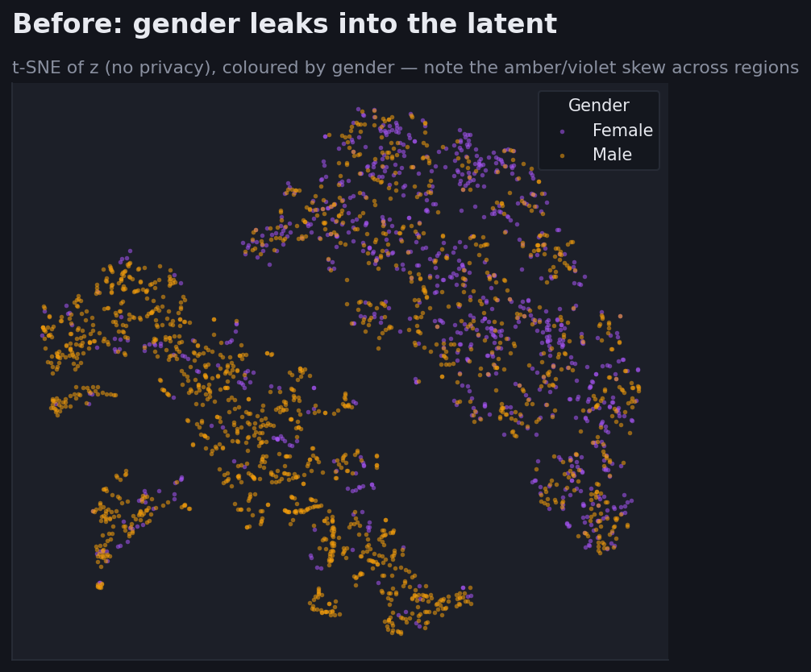
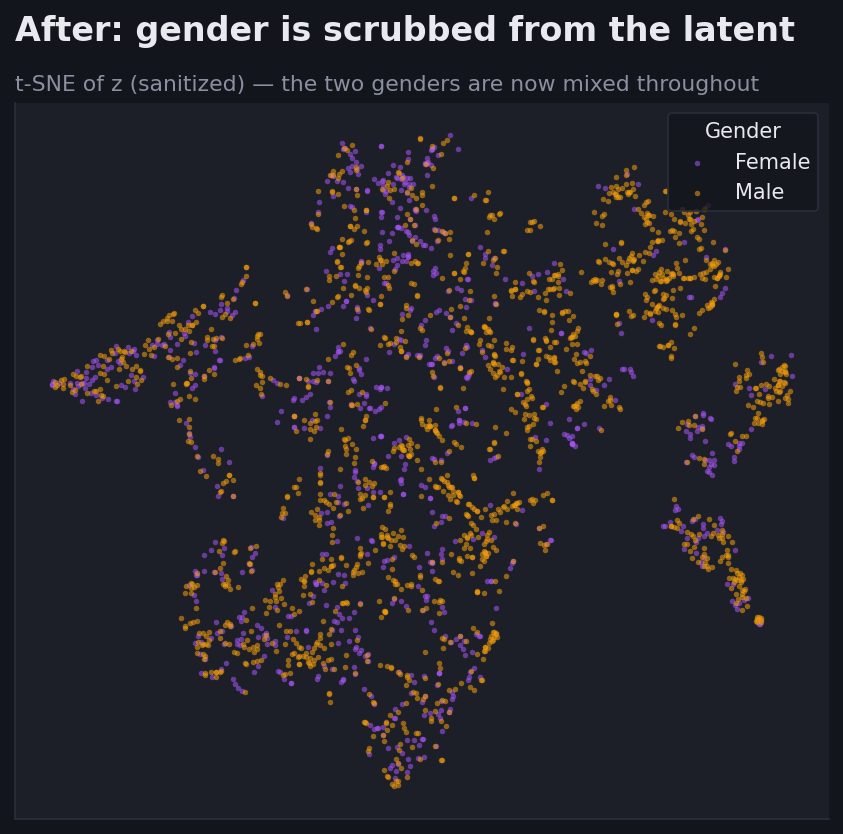
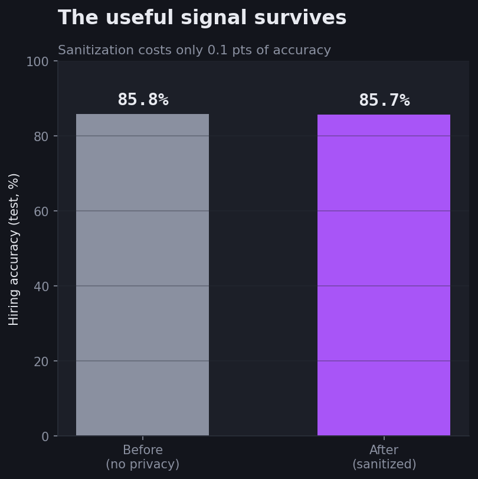
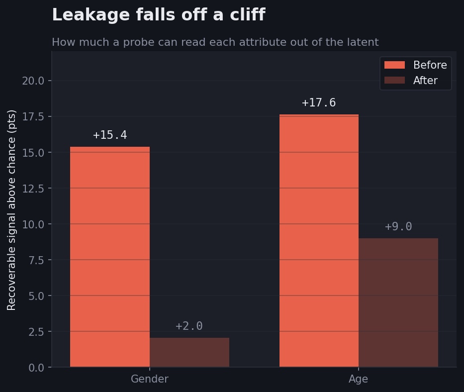
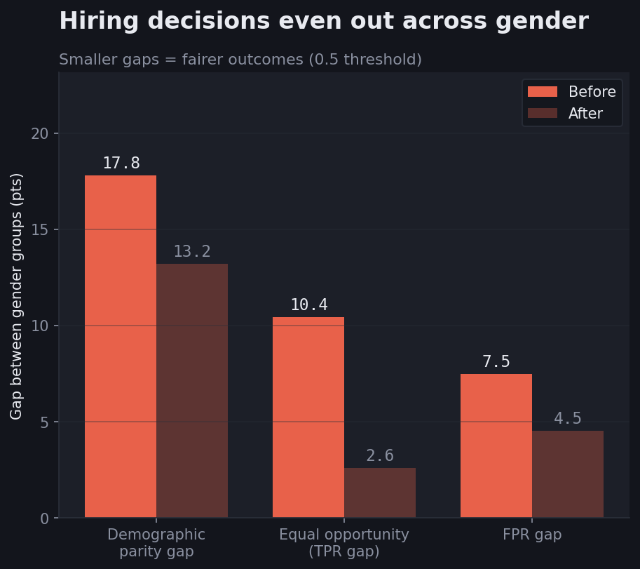
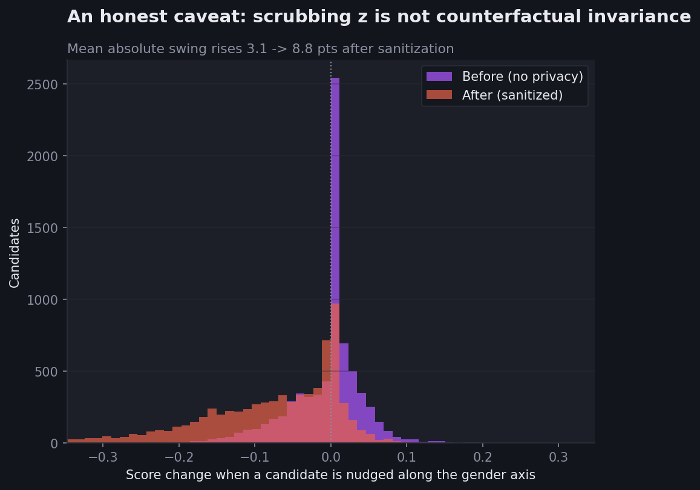

# FairHire AI

**Privacy-Preserving Functional Anonymizer via Adversarial Representation**

An AI hiring assistant that scrubs gender and age from its internal representation —
cutting how much those attributes can be recovered from its latent space and shrinking
the demographic gaps in its hiring decisions, at almost no accuracy cost — and that
honestly measures where representation scrubbing stops short of true counterfactual
fairness.

[**Live demo →**](#) &nbsp;·&nbsp; built by Shayan Ansari

---

## The 10-second story

> A model's internal representation can be made far harder to read. We train an encoder
> against simultaneous adversaries that try to recover gender and age from its latent
> space; their success collapses toward chance, the hiring gaps between groups shrink,
> and accuracy barely moves. But we also show the catch — a sanitized *representation*
> is not a counterfactually invariant *score*.

## The four plots

**1 & 2 — Gender dissolves out of the latent.** Each point is a real test candidate's
latent `z`, projected to 2-D with t-SNE and coloured by gender. Before sanitization the
colours skew across regions (gender is decodable); after, they blend (gender becomes
unreadable).

| Before | After |
|---|---|
|  |  |

**3 — The useful signal survives.** Hiring accuracy barely moves: **85.8% → 85.7%**.



**4 — Leakage falls off a cliff.** How much a probe can read each attribute out of the
latent, in points above chance: gender **+15.4 → +2.0**, age **+17.6 → +9.0**.



### Supporting evidence

**Group-fairness gaps shrink.** Demographic-parity gap **17.8 → 13.2**, equal-opportunity
(TPR) gap **10.4 → 2.6**, FPR gap **7.5 → 4.5** points.



**The honest caveat.** Gender is never a model input, so we audit *counterfactual*
sensitivity by nudging each candidate along the gender-predictive direction and measuring
the score swing. The sanitized model swings **more**, not less.



## What works — and the honest caveat

**What the sanitization buys.** On the held-out test set, training against the gender
and age adversaries drops gender leakage from **+15.4 to +2.0 pts** above chance and
age from **+17.6 to +9.0**, while hiring accuracy moves only **85.8% → 85.7%**. The
group-fairness gaps shrink too: demographic-parity gap **17.8 → 13.2**, equal-opportunity
(TPR) gap **10.4 → 2.6**, FPR gap **7.5 → 4.5** points.

**The honest caveat (Plot 5).** Gender is never a model input, so we audit
*counterfactual* sensitivity by nudging each candidate along the gender-predictive
direction in feature space and measuring the score swing. The sanitized model swings
**more**, not less (mean absolute swing **3.1 → 8.8 pts**), and two corroborating
instruments — a Husband↔Wife token flip and nearest opposite-gender matched pairs —
agree (see `logs/counterfactual.csv`). The lesson: adversarial scrubbing enforces
*representational* invariance on the data manifold, which is **not** the same as
*counterfactual* invariance of the score to input perturbations. We report this rather
than hide it; closing that gap (a counterfactual-consistency training objective) is the
natural next step.

## Methods

**Architecture.**

```
        Input features
              |
          [ Encoder ]
              |
              z  (sanitized latent representation)
              |
   +----------+-----------+-----------+------------+
   |          |           |           |            |
[Hiring]  [Gender]    [Age]      [Ethnicity]   (auditors attack z)
[Predictor] [Auditor]  [Auditor]  [Auditor]
   |          |           |           |
 main loss  adversarial losses via Gradient Reversal Layer (GRL)
```

**Multi-adversary sanitization.** A small MLP encoder maps each candidate's features to
a latent `z`. A hiring predictor learns income suitability from `z` (the main loss).
Simultaneously, a gender auditor and an age auditor try to recover those attributes from
`z`. Each auditor is connected through a **Gradient Reversal Layer (GRL)**: in the
forward pass it is the identity, but in the backward pass it multiplies the gradient by
`−λ`, so the encoder is pushed to make `z` *useless* to the auditors while keeping it
useful for hiring. Running **two adversaries at once** —
"Multi-Adversarial Representation Sanitization" — is the contribution over a textbook
single-adversary GRL setup. Ethnicity is *measured* but not targeted: in UCI Adult it is
~unrecoverable (the data is ~86% one group), so an ethnicity adversary would optimize
against noise.

**Keeping the adversary strong.** A single jointly-optimized GRL barely scrubbed (gender
only +15.4 → +12.4) because the encoder learns to fool one weak auditor instance while a
fresh probe still recovers the attribute. Fix: per batch we run `N_CRITIC=5` auditor-only
updates on the *detached* latent (a separate optimizer) so the adversary stays
near-optimal, then take one encoder+predictor step through the GRL. `λ` is ramped from 0
to its max (DANN-style warmup) for stability. Auditor capacity is held identical to the
Phase-2 leakage probe so the before/after comparison measures scrubbing, not a bigger
attacker.

**Measuring leakage.** "Leakage" is the accuracy of a freshly-trained probe reading a
sensitive attribute off the frozen `z`, reported as points *above* that attribute's
majority-class baseline. Gender at chance is ~66.6%; after sanitization the probe reaches
68.7% (+2.0). The before/after probes are identical in architecture so the drop reflects
the representation, not the attacker.

**Counterfactual audit (a sensitivity audit, not causal inference).** Gender is excluded
from the model input, so to test counterfactual sensitivity we perturb *proxies* and
measure the score drift across three independent instruments: (1) a nudge along the
gender-predictive logistic direction in feature space, (2) a Husband↔Wife relationship-
token flip, (3) nearest opposite-gender matched pairs. No DAGs, no do-calculus — we flip
the sensitive direction in the input and measure output drift. All three agree that the
sanitized model is *more* gender-sensitive, the honest limit reported above.

**Data & training.** UCI Adult Income (48,842 rows), stratified 70/15/15 split on the
income label; scaler and one-hot vocabularies fit on train only. Sensitive columns
(`sex`, `race`, `age`) are kept only as labels and dropped from the feature matrix, so the
auditors must recover them from proxy correlations rather than a direct copy. Chosen
`λ = 1.0` (the knee of a `{0.5, 1, 2, 4}` sweep: lowest mean gender+age leakage among the
runs that held accuracy within 2% of baseline). Experiment tracking is local CSV
(`logs/`), no external accounts.

## Reproduce

```bash
pip install -r requirements.txt
python -m src.data              # download + build splits  -> data/processed/adult.npz
python -m src.train_baseline    # "Before" model + leakage -> models/baseline.pt, logs/baseline.csv
python -m src.train_adversarial # "After"  model           -> models/sanitized.pt, logs/adversarial.csv
python -m src.evaluate          # the six plots + fairness/counterfactual CSVs -> plots/, logs/
python -m src.export_ui         # serialize both models for the browser -> ui/model.json, ui/data.json
```

Then open `ui/index.html` (or serve the `ui/` folder) for the live, client-side demo.

## Project layout

```
data/        UCI Adult Income dataset + processed splits
src/         encoder, predictor, auditors, GRL, training loops, evaluation, UI export
notebooks/   exploration and experiment notebooks
plots/       the exported PNGs (four headline + counterfactual + fairness)
models/      trained weights (baseline + sanitized)
ui/          premium dark-themed web interface (pure HTML/CSS/JS, runs the models in-browser)
logs/        CSV metrics (baseline, adversarial sweep, fairness, counterfactual)
```

## Stack

Python, PyTorch, scikit-learn, numpy, pandas. Matplotlib/seaborn for static plots; pure
HTML/CSS/JS + Chart.js for the web UI. Dataset: UCI Adult Income. Every tool free /
open-source; the demo runs entirely client-side with no server or paid hosting.

## Future work

The audit shows representational scrubbing does not by itself produce a counterfactually
invariant score. The natural next step is to train for that directly — a
**counterfactual-consistency penalty** that punishes score drift under gender-proxy
perturbations — moving toward full counterfactual fairness in the sense of
**Kusner et al., "Counterfactual Fairness" (NeurIPS 2017)**. That would add explicit
causal structure (which proxies mediate the sensitive attribute) on top of the current
representation-level invariance.
</content>
</invoke>
